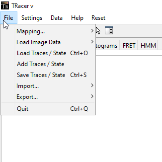
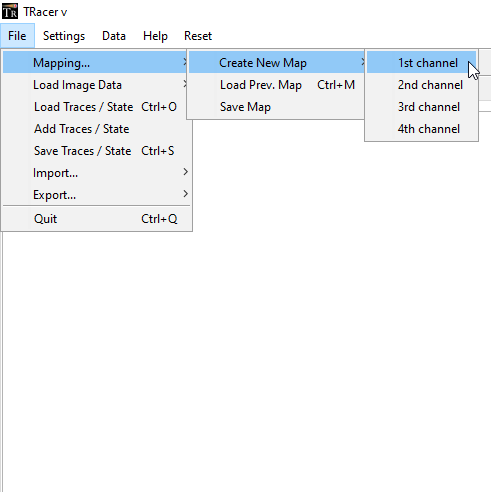
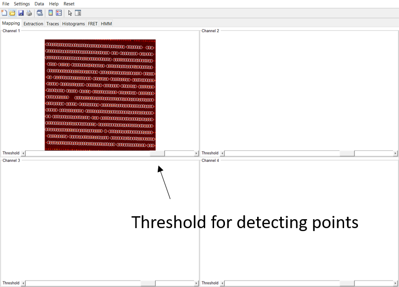
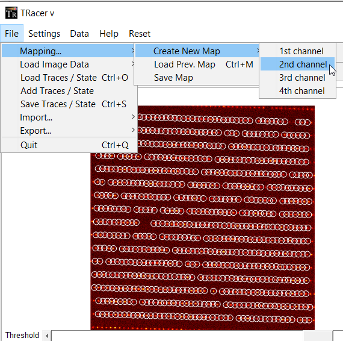
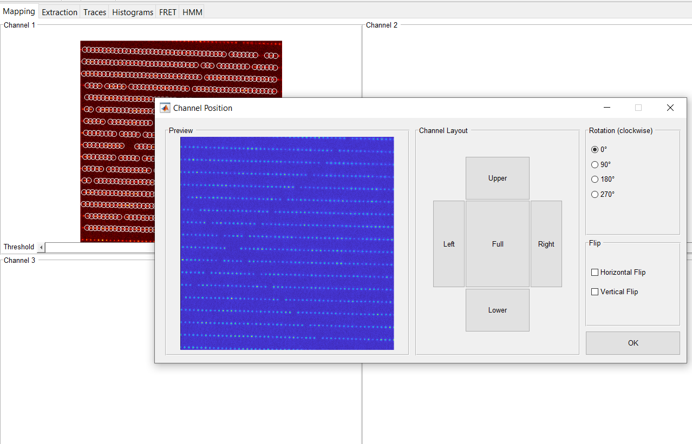
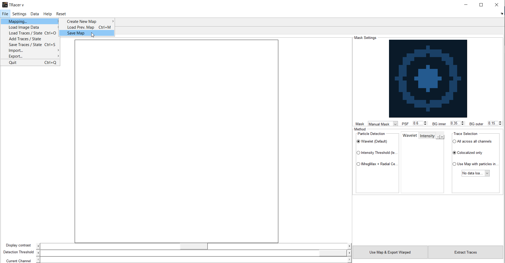
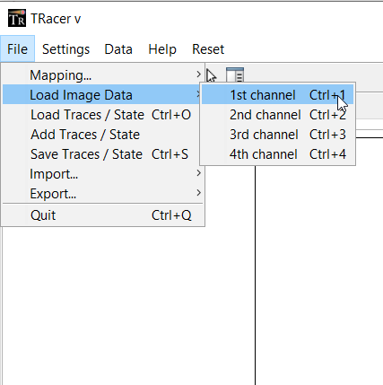

Documentation
=====

.. _documentation:

Documentation
------------

In this part, we try to give a brief introduction and overview of how to use the main functions of *Deep-LASI*. In most cases, it will be based on the example data provided with the publication and described in the :doc:`example` 
... write s.th.

Opening TRacer
-------------

Call the program *TRacer* from the MATLAB command window as shown in figure 1. After a couple seconds, the program environment will open. 

.. image:: ./../figures/documents/Fig_1_Call_Progamm.png
   :width: 300
   :alt: Call Tracer
   :align: center
   
.. centered:: *Figure 1. Calling TRacer from MATLAB command window*
 
Click on *File* to open the drop-down menu to see the provided options as follows:

* **Mapping** for adjusting the overlay of up to four detection channels, loading a previously saved map, or saving a created one.

* **Load Image Data** for loading data files from up to four detectors.

* **Load Traces/State** for loading any extracted and saved traces.

* **Add Traces/State** to add extracted traces to other ones especially useful to merge various measurements.

* **Save Traces/State** to save desired changes on traces for example in case of having done analysis steps.

* **Import** to insert different data types as time traces into the TRacer program.

* **Export** to transfer data to other software pieces or exporting the current view as other formats.

* **Quit** to terminate the program.

... text ...

.. image:: ./../figures/documents/Fig_3_Mapping_Menu.png
   :width: 300
   :alt: mapping menu
   
... text ...

   
   
... text ...

.. image:: ./../figures/documents/Fig_5_Map_Image_Uploading.png
   :width: 300
   :alt: map uploading
   
... text ...

   
... text ...

   
... text ...

   
... text ...

.. image:: ./../figures/documents/Fig_9_Mapping_Starting.png
   :width: 300
   :alt: start mapping
   
... text ...
   
.. image:: ./../figures/documents/Fig_10_Map_Before_After.png
   :width: 300
   :alt: check mapping
   
... text ...

   
 ... text ...  
 

   
... text ...  

.. image:: ./../figures/documents/Fig_13_Measurement_Parameters.png
   :width: 300
   :alt: inserting measurement parameters
   
... text ... 

.. image:: ./../figures/documents/Fig_14_Detecting_Particles.png
   :width: 300
   :alt: first channel detection
   
... text ... 

.. image:: ./../figures/documents/Fig_15_Data_Loading_Second_Channel.png
   :width: 300
   :alt: loading second channel
   
... text ... 

.. image:: ./../figures/documents/Fig_16_Measurement_Parameters_Second_Chan.png
   :width: 300
   :alt: inserting second measurement parameters
   
... text ... 

.. image:: ./../figures/documents/Fig_17_Detecting_Colocal.png
   :width: 300
   :alt: detection of colocalization
   
... text ... 

.. image:: ./../figures/documents/Fig_18_Extracting_Start.png
   :width: 300
   :alt: start extraction
   
... text ... 

.. image:: ./../figures/documents/Fig_19_Categorizing.png
   :width: 300
   :alt: categorizing
   
... text ... 

.. image:: ./../figures/documents/Fig_20_Categories.png
   :width: 300
   :alt: categorization options
   
... text ... 

.. image:: ./../figures/documents/Fig_21_Categories_3_Color.png
   :width: 300
   :alt: three color look
   
... text ... 

.. image:: ./../figures/documents/Fig_22_Cursor_Activating.png
   :width: 300
   :alt: activate cursor
   
... text ... 

.. image:: ./../figures/documents/Fig_23_Correction_Factor_Table.png
   :width: 300
   :alt: correction factor table
   
... text ... 

.. image:: ./../figures/documents/Fig_24_Histogram_Tab.png
   :width: 300
   :alt: going to histogram tab
   
... text ... 

.. image:: ./../figures/documents/Fig_25_Histogram_Tab_Categories.png
   :width: 300
   :alt: category selection for histogram
   
... text ... 

.. image:: ./../figures/documents/Fig_26_Measurement_Histograms.png
   :width: 300
   :alt: measurement histograms
   
... text ... 

.. image:: ./../figures/documents/Fig_27_FRET_Tab.png
   :width: 300
   :alt: going to FRET tab
   
... text ...

.. image:: ./../figures/documents/Fig_28_FRET_Tab_Categories.png
   :width: 300
   :alt: category selection in FRET tab
   
... text ...

.. image:: ./../figures/documents/Fig_29_Result_Histogram.png
   :width: 300
   :alt: get histogram
   
... text ...

.. image:: ./../figures/documents/Fig_30_Fitting_Histogram.png
   :width: 300
   :alt: fitting
   
... text ...

.. image:: ./../figures/documents/Fig_31_HMM_Tab.png
   :width: 300
   :alt: going to HMM tab
   
... text ...

.. image:: ./../figures/documents/Fig_32_HMM_Starting.png
   :width: 300
   :alt: starting HMM
   
... text ...

.. image:: ./../figures/documents/Fig_33_Trace_Tools.png
   :width: 300
   :alt: trace tools tab
   
... text ...

.. image:: ./../figures/documents/Fig_34_Magic_Button.png
   :width: 300
   :alt: magic button
   
... text ...

.. image:: ./../figures/documents/Fig_35_Number_of_States.png
   :width: 300
   :alt: choosing number of states
   
... text ...

.. image:: ./../figures/documents/Fig_36_de_ct.png
   :width: 300
   :alt: de and ct popping window
   
... text ...

.. image:: ./../figures/documents/Fig_37_Gamma.png
   :width: 300
   :alt: gamma factor popping window
   
... text ...

.. image:: ./../figures/documents/Fig_38_FRET_Histogram.png
   :width: 300
   :alt: efficiency popping window
   
... text ...

.. image:: ./../figures/documents/Fig_39_State_Certainty.png
   :width: 300
   :alt: state certainty popping window
   
... text ...

.. image:: ./../figures/documents/Fig_40_TDP_Bins.png
   :width: 300
   :alt: inserting the number of bins for TDP
   
... text ...

.. image:: ./../figures/documents/Fig_41_TDP_Cluster_Selection.png
   :width: 300
   :alt: cluster selection
   
... text ...

.. image:: ./../figures/documents/Fig_42_TDP_to_Fit.png
   :width: 300
   :alt: sending TDP cluster to fit
   
... text ...

.. image:: ./../figures/documents/Fig_43_TDP_Fitting.png
   :width: 300
   :alt: fitting TDP cluster 
   
... text ...

.. image:: ./../figures/documents/Fig_44_Loading_Network.png
   :width: 300
   :alt: neural network
   
... text ...

.. image:: ./../figures/documents/Fig_45_Loading_HMM_Network.png
   :width: 300
   :alt: neural network for HMM
   
... text ...

.. image:: ./../figures/documents/Fig_46_HMM_Result_Choosing.png
   :width: 300
   :alt: Choosing raw or corrected efficiency for TDP
   
... text ...
