Documentation
=====

.. _documentation:

Documentation
------------

In this part, we give a brief introduction and overview of how to use the main functions of *Deep-LASI*. In most cases, it will be based on the example data provided with the publication and described in the :doc:`example` 
Using the steps described here you should be able to analyze your single molecule data.

Opening TRacer
-------------

Call the program *TRacer* from the MATLAB command window as shown in figure 1. After a couple seconds, the program environment will open. 

.. image:: ./../figures/documents/Fig_1_Call_Progamm.png
   :width: 300
   :alt: Call Tracer
   :align: center

Figure 1. Calling TRacer from MATLAB command window

Click on *File* to open the drop-down menu as shown on figure 2 to see the provided options as follows:

* **Mapping** for adjusting the overlay of up to four detection channels, loading a previously saved map, or saving a created one.

* **Load Image Data** for loading data files from up to four detectors.

* **Load Traces/State** for loading any extracted and saved traces.

* **Add Traces/State** to add extracted traces to other ones especially useful to merge various measurements.

* **Save Traces/State** to save desired changes on traces for example in case of having done analysis steps.

* **Import** to insert different data types as time traces into the TRacer program.

* **Export** to transfer data to other software pieces or exporting the current view as other formats.

* **Quit** to terminate the program.

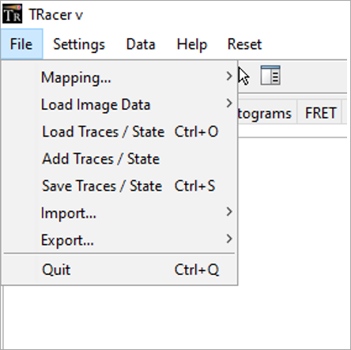
   
Figure 2. TRacer file menu

On the tab **Settings** beside the file, you can enter the camera settings you are using for measuring, so have them saved and easily accessible there.

By the tab **Data** you can change the colormap from the default *jet* to other options provided. It especially changes the style of the detected molecules inside the mask that is shown besides the traces. With **Plot Units**, you can change the way traces are shown by checking or unchecking the provided items, and directly having their effect on all your traces. The first one, **'Photons(Cam.calibrated)'**, changes the y axis to be the number of photons reaching the cameras, the second one **'Mean Across Particle Mask'** showes the mean emission intensity of the particle within the detection mask on the y axis. The correction factors **gamma**, **beta**, and **alpha** could be separately applied to the intensity traces. One can also choose to cancel the background subtraction from the intensity traces, and have them as raw intensities. With the last option you can choose to have the corrected FRET efficiency on the corrresponding panel. Of course for the correction factors to be incorporated on the traces, you should have them already determined.

With the **Reset** button, you can restart the TRacer program, meaning that whatever you did or changed on the program will be discarded unless you had it saved.

Mapping
-------------

If mapping is required between two or more cameras, go to **Mapping** from the menu under file. Then choose ‘Create New Map’ and the ‘First Channel’. You can see the path on figure 3.

.. image:: ./../figures/documents/Fig_3_Mapping_Menu.png
   :width: 500
   :alt: Open mapping menu
   :align: center
   
Figure 3. Mapping menu

Now the program will ask you to choose a file which could be an image or a series of images as a video file usually taken from a calibration pattern like a zero-mode waveguide. After choosing the file, the image gets open together with some adjusting options, like figure 4.

.. image:: ./../figures/documents/Fig_4_Map_Image_Uploading.png
   :width: 300
   :alt: map uploading
   :align: center 
   
Figure 4. Uploading first mapping image

On the window opened for the user, you can use the **Channel Layout** to take the desired field of view. You can take the whole area or select a specific region with the buttons provided for that. There are also the options of rotating or flipping the image, so that all images from various cameras show the same pattern. Then click on OK. The image will be open on the mapping tab, figure 5. 

.. image:: ./../figures/documents/Fig_5_Map_Image_Detecting.png
   :width: 300
   :alt: map detection
   :align: center

Figure 5. Mapping image loaded to TRacer

With the threshold bar, make sure that enough points are circled and detected by the program. Then continue opening images from other detectors with the same procedure, as shown on images 6 and 7. 

.. image:: ./../figures/documents/Fig_6_Map_Second_Channel.png
   :width: 300
   :alt: second map image
   :align: center
   
Figure 6. Opening the second mapping image

.. image:: ./../figures/documents/Fig_7_Map_Second_Uploading.png
   :width: 300
   :alt: second map uploading
   :align: center
   
Figure 7. Adjusting the image for the second mapping image

After opening the mapping images from all the cameras, select which channel you prefer to be the reference channel, like figure 8. In most cases, the first channel is taken as the reference one unless you have a special mapping plan.

.. image:: ./../figures/documents/Fig_8_Mapping_Starting.png
   :width: 300
   :alt: start mapping
   :align: center

Figure 8. Performing the mapping step

Then click on **Start Mapping**. The mapping process goes quit fast and gives the mapping result as before and after images like figure 9. It is recommended to check the quality of mapping. In some cases you might have to take new images for this step if the image quality you uploaded was not acceptable which is a rare event! 
   
.. image:: ./../figures/documents/Fig_9_Map_Before_After.png
   :width: 300
   :alt: check mapping
   :align: center
   
Figure 9. Mapping result

After mapping, the extraction tab opens showing a detection mask created like the one shown on the top right part of figure 10. This maske is used to calculate the emission intensity of the particle inside the central circle, and also the background within the outer ring. The user has the freedom to change the mask settings when needed. You have the option of saving the created map or loading a previous map from the same mapping menu. 

.. image:: ./../figures/documents/Fig_10_Map_Saving.png
   :width: 300
   :alt: check mapping
   :align: center
   
Figure 10. The mask created after mapping 
 
Loading the data 
-------------
 
Now you can open the data files from file menu and **Load Image Data** similar to opening the mapping images like shown on figure 11. The order of channels should be the same as mapping order. 
 
.. image:: ./../figures/documents/Fig_11_Data_Loading.png
   :width: 300
   :alt: loading first channel
   :align: center
   
Figure 11. The menu for loading image data 

TRacer asks you to choose the data files, and you can open all the files from each channel at a time. After a short time, the following window (figure 12) will open to take the measurement parameters. The first box is for the sum of exposure time and frame transfer. For example in case of measuring with the exposure time of 50 ms, and the frame transfer of 2.2 ms, we can enter 52.2.

.. image:: ./../figures/documents/Fig_12_Measurement_Parameters.png
   :width: 300
   :alt: inserting measurement parameters
   :align: center
   
Figure 12. The window for specifying measurement parameters 

The second box is to get the ALEX sequence used for illuminating the sample. Different combinations of two or three laser excitation can be entered here. Note that for the IR laser, you should only enter the letter ‘I’. The letter ‘G’ works for lasers in green or yellow region. Then you put the slider on the corresponding channel, for example, on the image shown here on the left or right position depending on reading data from first or second channel. It gets three devisions in case of a three-channel experiment.

Then choose which frames you want to load on the program by using the **Load frame range**. Also depending on the experiment, you can choose the range of desired frames for detecting the particles and extracting their intensity traces. TRacer takes all the frames by default and you can change them as you wish.

The option of choosing the dye does nothing at the moment, but a library of various dyes could be added to the program so that dye specific information help us with a more complete analysis.

As the last step here, click on the corresponding channel color from the four options provided. Now TRacer opens the first data file from the range that you selected, like figure 13.

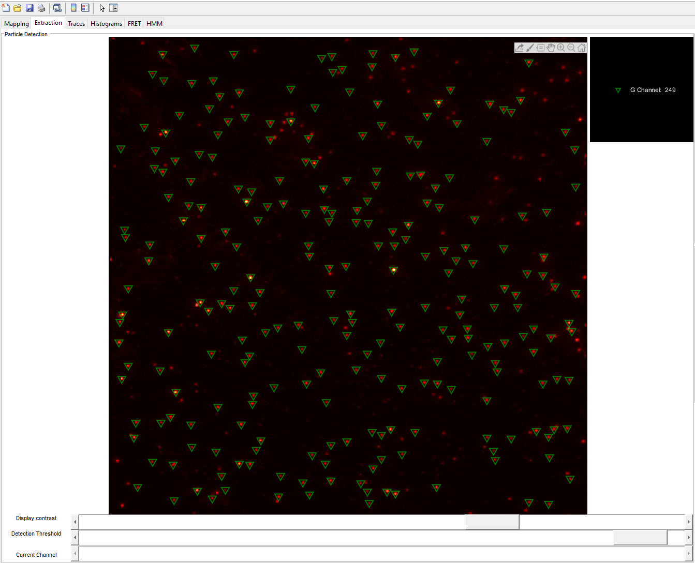
   
Figure 13. Particle detection for the first channel data 

The sliders below the image are to adjust the display contrast, and detection threshold so that one gets more particles detected. The detected particles are inside a triangle within the image, and the number of them is shown in the box next to the image on the top right position.

Continue opening the data images for the next channel(s) from the same menu, as shown on figure 14.

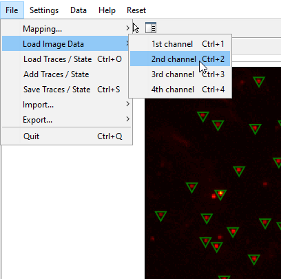
   
Figure 14. Loading data from other detectors

Each time you load image files, the pop-up window appears asking you about the channel color to extract the data in the correct order.

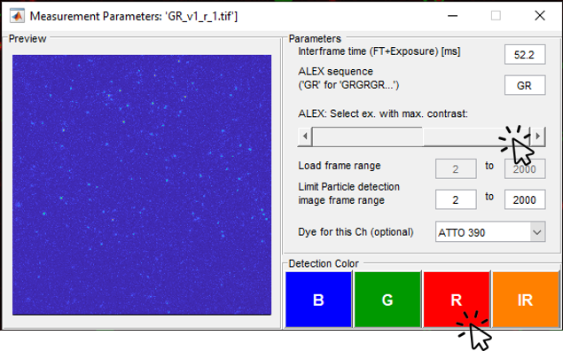
   
Figure 15. Updating measurement parameters

The example figures show a two-color measurement. As shown on figure 15, we put the slider on the second half to indicate the second channel (the same procedure works for the third channel by putting the slider to the most right position.), and also click on the R to indicate the acceptor channel (red in this case). After a short time the first frame of the second channel overlays on the image from the first one.

.. image:: ./../figures/documents/Fig_16_Detecting_Colocal.png
   :width: 300
   :alt: detection of colocalization
   :align: center
   
Figure 16. Detection of particles and their co-localization 

The color of triangles show the detected emitters on each corresponding channel and the circles show the co-localized particles. All the numbers are also reported in the small box on the top.

You can decide which particles you want to analyze using the options in the right box **Trace Selection** and then click on **Extract Traces**. In the example shown on figure 17 only the co-localized particles are considered to study their FRET.

.. image:: ./../figures/documents/Fig_17_Extracting_Start.png
   :width: 300
   :alt: start extraction
   :align: center
   
Figure 17. Starting the extraction 

Intensity Traces
-------------

After the extraction step which might take a while depending on the amount of data loaded, the resulting traces will open on the next tab called **Traces** as shown on figure 18 for both two- and three-color measurements. You can see on the left side that 6100 two-color traces were extracted from the loaded data set.

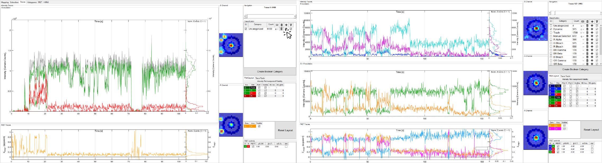
   
Figure 18. Examplary traces for a two-color measurement on the left, and three-color on the right 

On figure 18 on the left, you see the time trace of both donor and acceptor in the left upper pannel. Because of illuminating the sample using ALEX mode, a lot of information are available on each trace. The gray plot is the total intensity on the donor channel which in theory is expected to have a stable value before a bleaching step. The green trace is the signal of donor after donor excitation, the red trace is the emission of acceptor after donor excitation (FRET), and the dark red is the emission of acceptor after acceptor excitation. You can choose which intensity trace be shown from the right box **Plot Layout** by checking or unchecking the corresponding boxes.

The lower pannel in orange, is the time trace of FRET efficiency. You can also choose which efficiency trace to see. It especially comes handy in case of having more than one FRET pair like the case shown on the right part. In the middle column, the detected particle on each channel is shown inside the detection mask, and in addition to the trace information this can also help to decide if we have a single molecule or not. For example you should see one emitter in the middle and no particle sitting on the background ring, since it will falsify the background calculation.

For a three-color measurement, you will get an additional pannel. As shown on figure 18 on the right, the uppest pannel consists of all the intensities after the blue excitation in the blue channel. So the dark blue is the emission of the blue dye after blue excitation, the light blue is the emission of green dye after the blue excitation, and the purple trace is the emission of red dye after blue excitation. The rest of the pannels are the same as described before.

With the **navigation** slider you can go through all traces, and with the **classification** part, you can manually cetegorize your traces into several categories based on your analysis needs, see an example on figure 19. All traces are by default in the **Uncategorized** section, by clicking on the plus sign you can add more categoties, rename, and also assign keyboard letters to transfer them to a corresponding category by simply pressing the assigned key.

.. note:: You can not assign the letters **A**, **D**, or **E** to your categories. These are the keys that you can use to go to the previous trace (A), the next trace (D), and have the program select analysis region for you (E).

You can also delete an unwanted category with the trash can icon or uncheck the filter box to prevent them being visible. It is especially helpful for the trash category for example. When you assign a trace to a specific category, it will be automatically removed from the first **Uncategorized** one.

.. image:: ./../figures/documents/Fig_19_Categories.png
   :width: 300
   :alt: categorization options
   :align: center
   
Figure 19. Navigation and categorization

For selecting the desired region on each trace for furthur analysis, you can drag the mouse to make the selected region shadowed, for example from the begenning of a trace until a bleaching step. By clicking on the trace region, the mouse turns to an active cursor for a general selection for example when all the dyes are active. TRacer will use the first bleaching step to calculate the correction factors. If you want to select channel specific regions, press the numbers 1,2,… to indicate the channel with the same order you loaded the images, and then you can select the region by the cursor special to each channel like the example on figure 20 for the red channel as the second one. For other channels the cursor shows the other corresponding letters like B, G, and I.

.. image:: ./../figures/documents/Fig_20_Cursor_Activating.png
   :width: 300
   :alt: three color look
   :align: center
   
Figure 20. Activated cursor specific for red channel 

The next photo shows an example of region selection for both green and red channels. Here the FRET efficiency trace gets the selection until the first bleaching step, and this region will be added to the FRET histogram in the end. 

The correction factors calculated from each trace are in the **FRET contol** box on the lower right corner. If a trace is not suitable for calculating the correction factors, then the median value of the whole data set would be applied on that. 

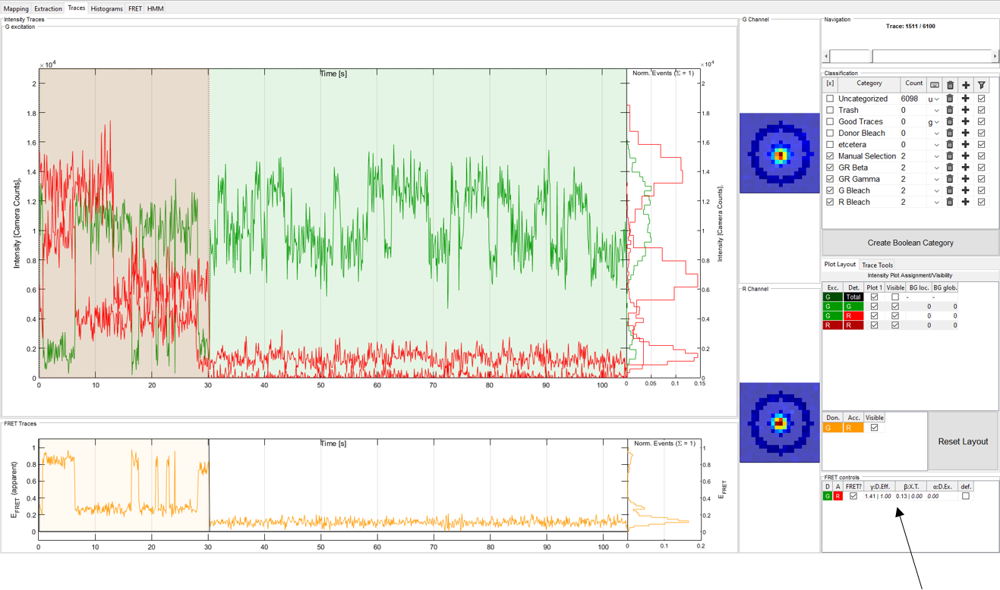
   
Figure 21. Correction factors based on the selected region on a trace

After having all the traces categorized, you can move on to the **Histograms** tab (figure 22), choose the category you want which are the same as you defined (figure 23), and get information about your data as histograms already fitted. Information such as the total signal, background level, countrate, signal to noise ratio, and bleaching time, figure 24. The fitting results are provided in a table on the right side.

.. image:: ./../figures/documents/Fig_22_Histogram_Tab.png
   :width: 300
   :alt: correction factor table
   :align: center
   
Figure 22. Histogram tab

.. image:: ./../figures/documents/Fig_23_Histogram_Tab_Categories.png
   :width: 300
   :alt: going to histogram tab
   :align: center
   
Figure 23. Categories shown on *Histogram* tab 

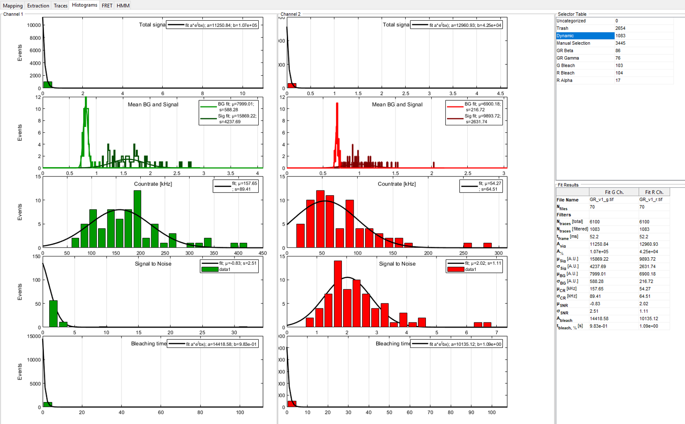
   
Figure 24. Measurement histograms 

Then you can move on to the **FRET** tab, and again choose the desired category by clicking on the plus sign beside the list.

.. image:: ./../figures/documents/Fig_25_FRET_Tab.png
   :width: 300
   :alt: FRET tab 
   :align: center
   
Figure 25. FRET tab on TRacer   
   
.. image:: ./../figures/documents/Fig_26_FRET_Tab_Categories.png
   :width: 300
   :alt: FRET tab categories 
   :align: center
   
Figure 26. Choosing categories on *FRET* tab

After choosing the category, you can select from the **Plot Mode** which plot to get. In the example shown on figure 26, you get the histogram of apparent FRET efficiency, like the one in figure 27. 

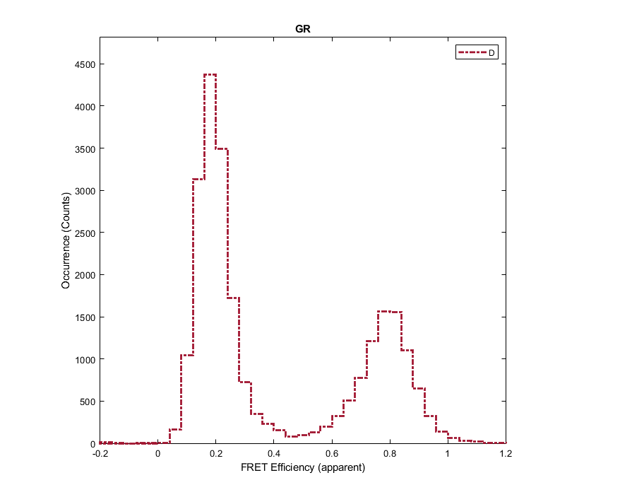
   
Figure 27. An exemplary histogram of apparent FRET efficiency with two populations

There are options in **Display Settings** (see figure 28) to make the framewise and/or moleculewise plot visible, normalize them, and also to fit them by choosing the best fitting method. If sometimes fitting seems so wrong, you can manually insert some values based on what you roughly see on the plot, fix them and fit again. By playing around the fitting gets better, then you can uncheck the fixing boxes and let the program find the best fitting values. You can also change the color of your plot(s) by clicking on the colored rectangle and choose a desired color.

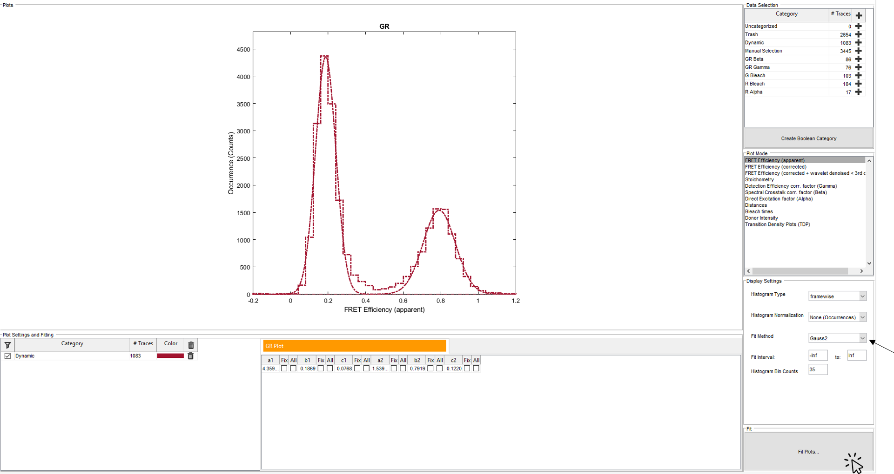

Figure 28. Display settings for the resulting plots

On the HMM tab, you can again select a category and run the HMM on it. This option works for two-color measurements at the moment. There are some other options for analysis the kinetics of a three-color measurement which will come shortly in the following parts.

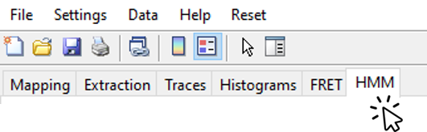
   
Figure 29. HMM tab on TRacer

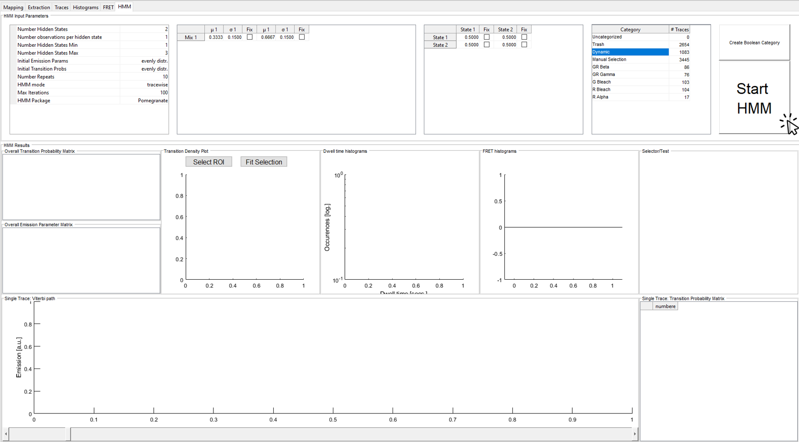
   
Figure 30. Starting HMM on data

Automated Analysis by Deep Learning
-------------

In case you want to save time and not go through all the analysis steps manually which might take days and even weeks especially for categorizing, you can use the automated analysis provided in the **Deep Learning** tab, Figure 31. This is an additional program using pre-trained deep neural networks incorporated into TRacer.

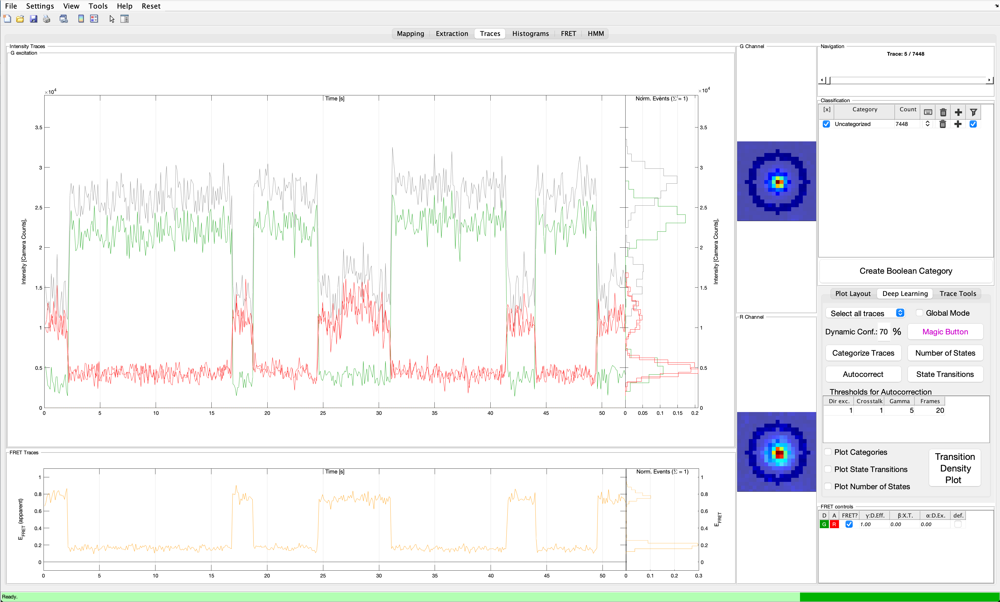
   
Figure 31. The automated analysis tab, **Deep Learning**

The simplest way to get your final results is to click on **Magic Button** (figure 32) and the program will do all the steps of categorization, correction, and dynamics analysis for you! All neural network models are chosen automatically dependent on the number of channels in your data set. The first step is the categorization of all traces. Note, that only dynamic traces reaching the confidence threshold (editable the deep learning tab) will be included in the category 'Dynamic (filtered)' and further analyzed. The **Magic Button** simply calls a series of functions which you also have access to individually, namely **Categorize Traces**, **Autocorrect**, **Number of States** and **State Transitions**. For the prediction of state transitions you have more freedom if you call the function separately. For example, you can run the prediction on fully corrected data, choose a specific model in case you have prior knowledge about the system or feed all frames into the state classifier without prior categorization of the trace classifier.

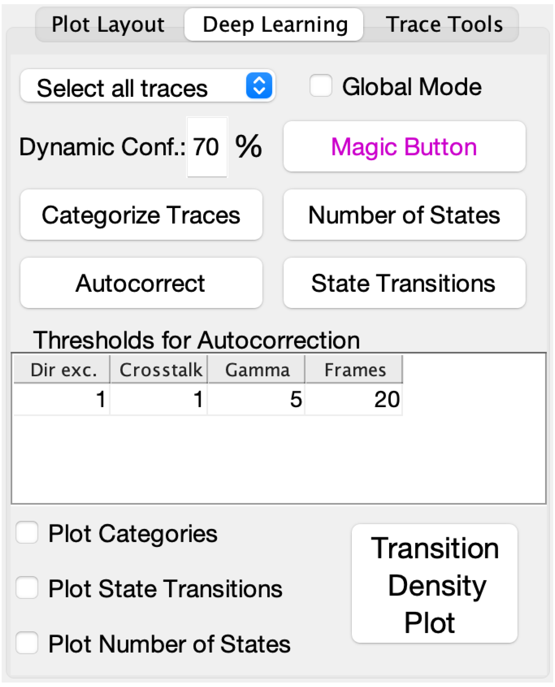
   
Figure 32. Deep Learning Tab with Magic Button

After trace classification, auto calculation of all available correction factors is performed. Figure 33 shows the histograms of the extracted direct excitation, crosstalk and gamma factors with the corresponding median, mean, and mode values. Gamma factors are calculated 3-fold for median, mean and mode values of direct excitation and crosstalk to show you the influence of these globally used correction factors on the gamma factor. The total number of traces and frames used for the calculation of each correction factor is displayed above the histrograms.

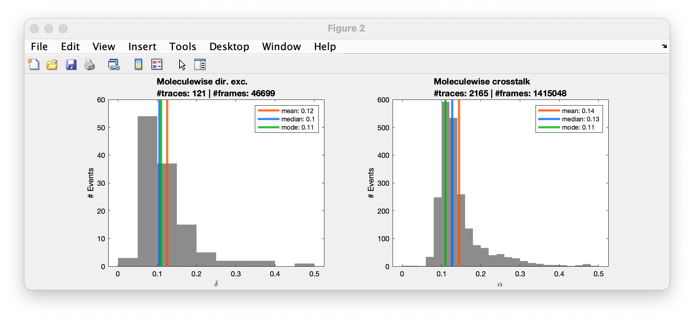
   
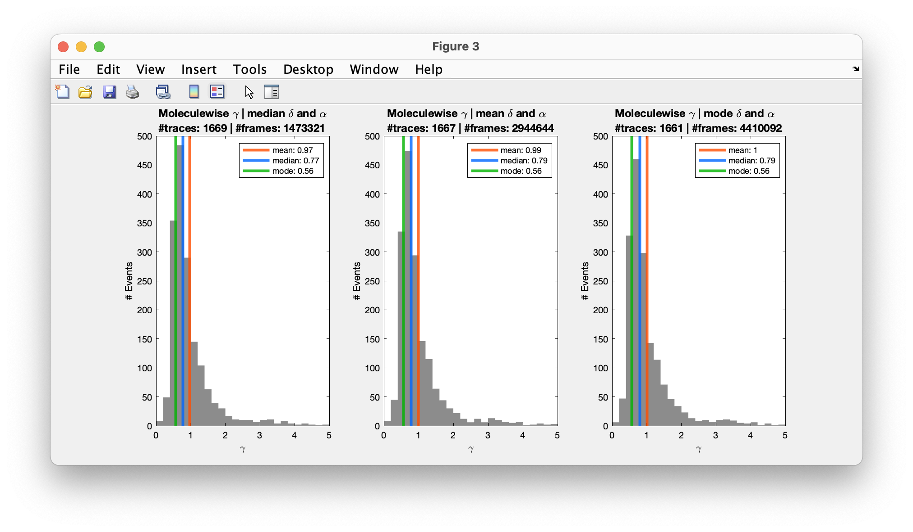
Figure 33. Correction factors histograms

After trace classification and correction, the number of states classifier will predict the most probable number of states for each trace. The corresponding confidence values will be shown in a pop up histogram.

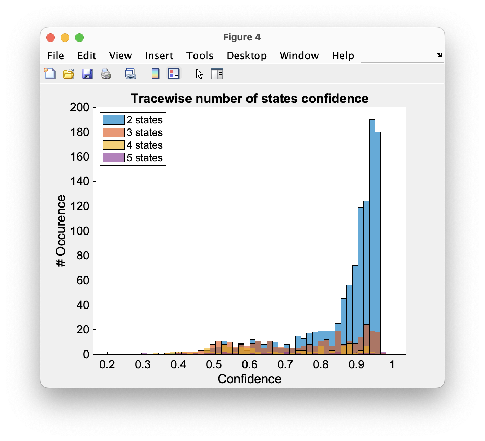
Figure 34. Number of states confidence for each trace

The predictions of the number of states classifier are used for model selection of the state transition classifier, which subsequently sort all frames in the dynamic traces into state occupancy. Figures 35 and 36 show a histogram of statewise FRET efficiency and tracewise state confidence, respectively.

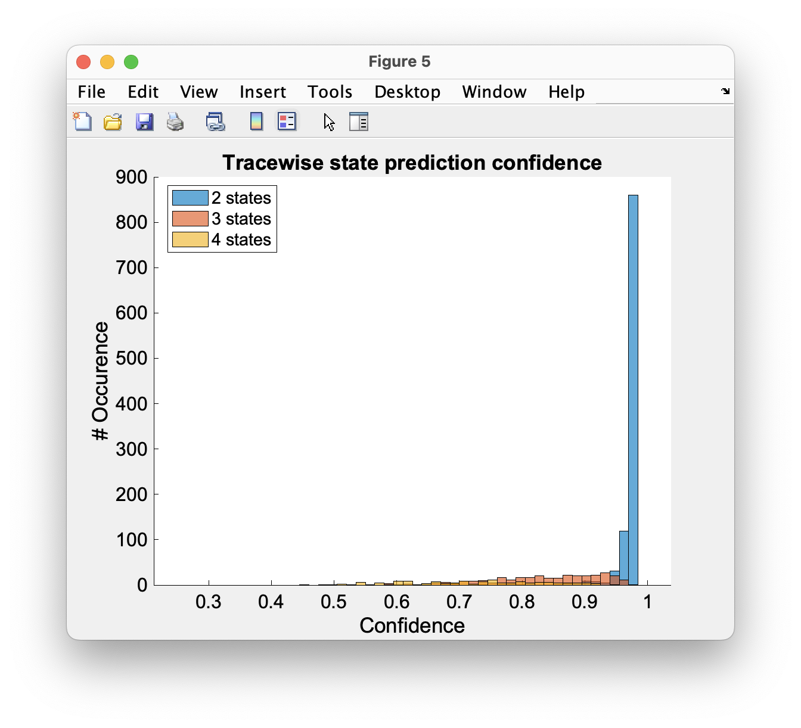
Figure 35. Histogram of apparent FRET

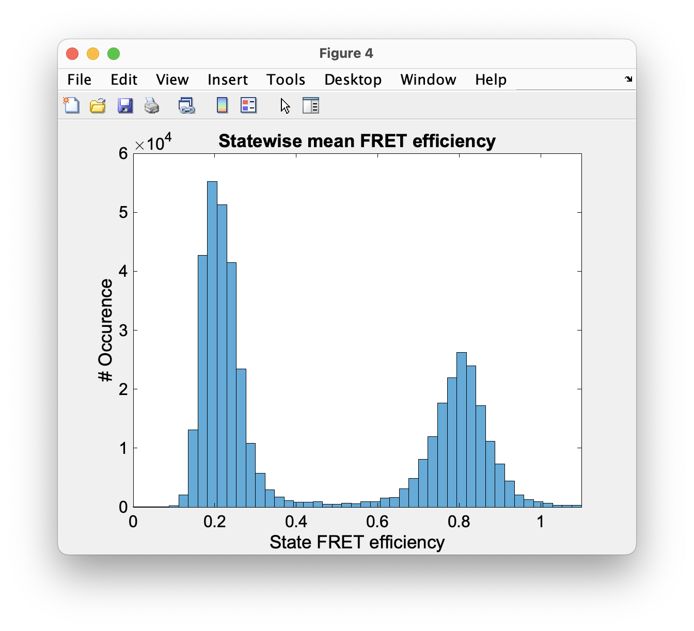
Figure 36. Sate certainty of the neural network

After all neural network predictions are completed, the program asks you to choose the number of bins, the confidence threshold and the number of states categories to include in the TDP (Transition Density Plot).

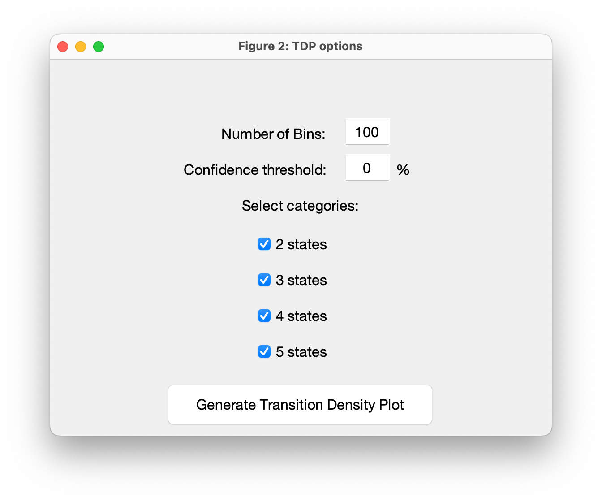
   
Figure 37. TDP input parameters

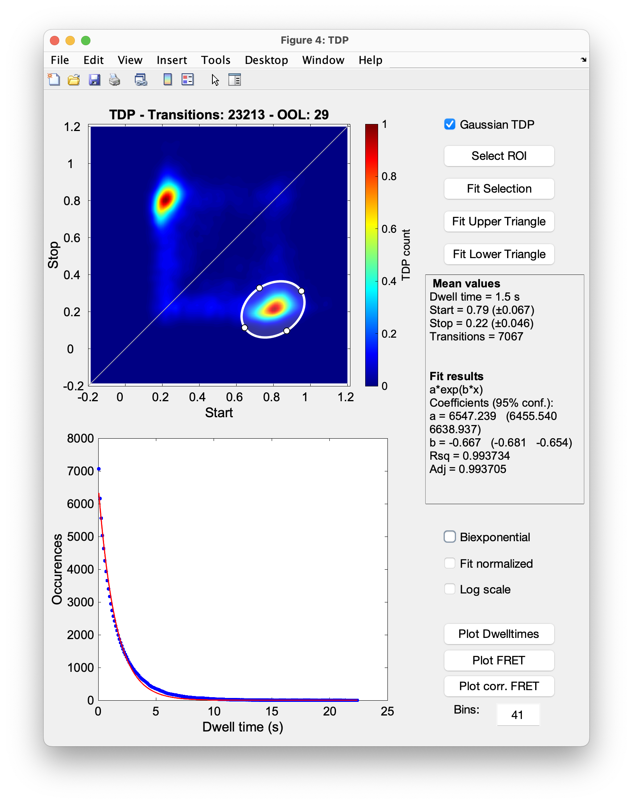
   
Figure 38. TDP with live fit panel

By clicking on **Select ROI**, you can choose a cluster and obtain dynamic information about it. The mean values of dwelltime, initial and final FRET, and the number of transitions appear on the rext box to the right. The live fit panel below fits the selected dwellimes with an exponential. By choosing the **Fit Selection**, **Fit Upper Triangle** or **Fit Lower Triangle** you can fit the dwell times using the Curve Fitting Toolbox™ from MATLAB (not available in compiled programs!). **Plot Dwelltimes** will plot the dwelltimes of the selected transitions in a histogram. **Plot FRET** and **Plot corr. FRET** show you the histogrammed apparent and corrected FRET efficiency of the selection, respectively. In case of 3-color FRET data, the FRET efficiencies of all other dye pairs are shown as well.

Magic button is the fully automated step. You may also intend to take separate and different analysis steps without the magic button. For that, you first need to load a neural network from the same table of **Trace Tools**, figure 41. First choose the closest option to your measurement from the drop-down menu on the right, and then click on **Load Neural Network**. Then with the options provided you can do the necessary analysis on your data and get the results within a couple of minutes. Note that to do the autocorrect, you should first click on **Categorize** and then click on **Autocorrect**. After having the categories made by the software, you always have the option of going through the traces, make any changes, and save the current status of the data set.
