Documentation
=====

.. _documentation:

Documentation
------------

In this part, we try to give a brief introduction and overview of how to use the main functions of *Deep-LASI*. In most cases, it will be based on the example data provided with the publication and described in the :doc:`example` 
... write s.th.

Opening TRacer
-------------

Call the program *TRacer* from the MATLAB command window as shown in figure 1. After a couple seconds, the program environment will open. 

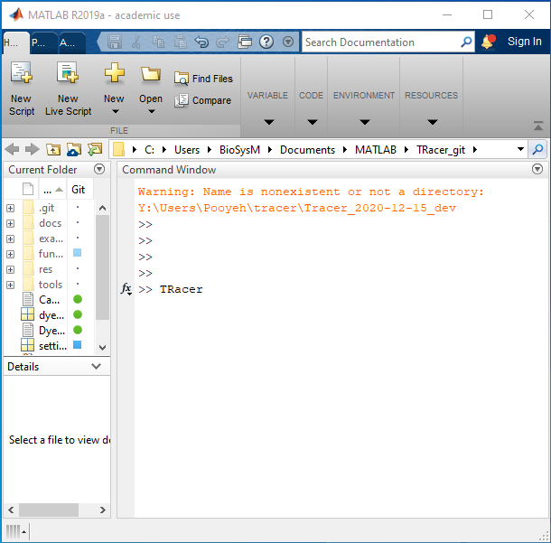
   
Figure 1. Calling TRacer from MATLAB command window

Click on *File* to open the drop-down menu as shown on figure 2 to see the provided options as follows:

* **Mapping** for adjusting the overlay of up to four detection channels, loading a previously saved map, or saving a created one.

* **Load Image Data** for loading data files from up to four detectors.

* **Load Traces/State** for loading any extracted and saved traces.

* **Add Traces/State** to add extracted traces to other ones especially useful to merge various measurements.

* **Save Traces/State** to save desired changes on traces for example in case of having done analysis steps.

* **Import** to insert different data types as time traces into the TRacer program.

* **Export** to transfer data to other software pieces or exporting the current view as other formats.

* **Quit** to terminate the program.

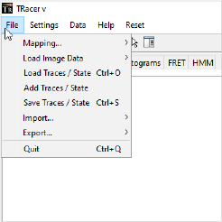
   
Figure 2. TRacer file menu

Mapping
-------------

If mapping is required between two or more cameras, go to ‘Mapping’ from the menu under file. Then choose ‘Create New Map’ and the ‘First Channel’. You can see the path on figure 3.

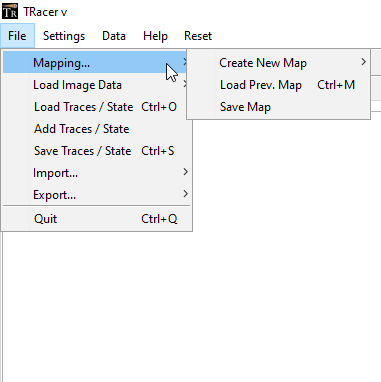
   
Figure 3. Mapping menu

Now the program will ask you to choose a file which could be an image or a series of images as a video file usually taken from a calibration pattern like a zero-mode waveguide. After choosing the file, the image gets open together with some adjusting options, like figure 4.

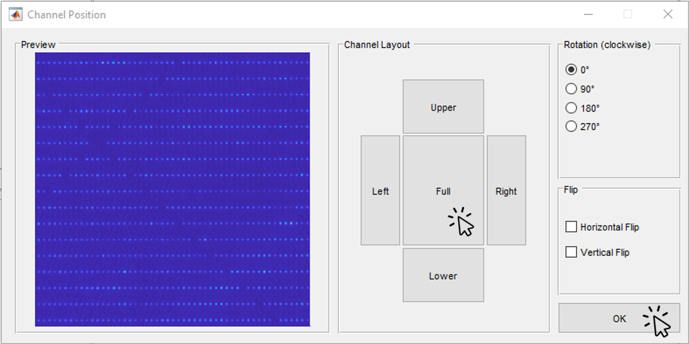
   
Figure 4. Uploading first mapping image

On the window opened for the user, you can use the **Channel Layout** to take the desired field of view. You can take the whole area or select a specific region with the buttons provided for that. There are also the options of rotating or flipping the image, so that all images from various cameras show the same pattern. Then click on OK. The image will be open on the mapping tab, figure 5. 

.. image:: ./../figures/documents/Fig_5_Map_Image_Detecting.png
   :width: 300
   :alt: map detection
   :align: center

Figure 5. Mapping image loaded to TRacer

With the threshold bar, make sure that enough points are circled and detected by the program. Then continue opening images from other detectors with the same procedure, as shown on images 6 and 7. 

.. image:: ./../figures/documents/Fig_6_Map_Second_Channel.png
   :width: 300
   :alt: second map image
   :align: center
   
Figure 6. Opening the second mapping image

.. image:: ./../figures/documents/Fig_7_Map_Second_Uploading.png
   :width: 300
   :alt: second map uploading
   :align: center
   
Figure 7. Adjusting the image for the second mapping image

After opening the mapping images from all the cameras, select which channel you prefer to be the reference channel, like figure 8. In most cases, the first channel is taken as the reference one unless you have a special mapping plan.

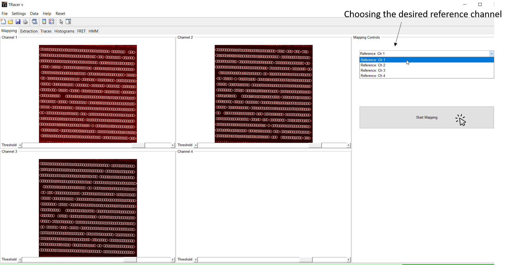

Figure 8. Performing the mapping step

Then click on **Start Mapping**. The mapping process goes quit fast and gives the mapping result as before and after images like figure 9. It is recommended to check the quality of mapping. In some cases you might have to take new images for this step if the image quality you uploaded was not acceptable which is a rare event! 
   
.. image:: ./../figures/documents/Fig_9_Map_Before_After.png
   :width: 300
   :alt: check mapping
   :align: center
   
Figure 9. Mapping result

After mapping, the extraction tab opens showing a detection mask created like the one shown on the top right part of figure 10. This maske is used to calculate the emission intensity of the particle inside the central circle, and also the background within the outer ring. The user has the freedom to change the mask settings when needed. You have the option of saving the created map or loading a previous map from the same mapping menu. 

.. image:: ./../figures/documents/Fig_10_Map_Saving.png
   :width: 300
   :alt: check mapping
   :align: center
   
Figure 10. The mask created after mapping 
 
Loading the data 
-------------
 
Now you can open the data files from file menu and **Load Image Data** similar to opening the mapping images like shown on figure 11. The order of channels should be the same as mapping order. 
 
.. image:: ./../figures/documents/Fig_11_Data_Loading.png
   :width: 300
   :alt: loading first channel
   :align: center
   
Figure 11. The menu for loading image data 

TRacer asks you to choose the data files, and you can open all the files from each channel at a time. After a short time, the following window (figure 12) will open to take the measurement parameters. The first box is for the sum of exposure time and frame transfer. For example in case of measuring with the exposure time of 50 ms, and the frame transfer of 2.2 ms, we can enter 52.2.

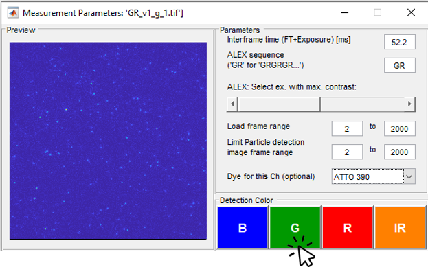
   
Figure 12. THe window for specifying measurement parameters 

The second box is to get the ALEX sequence used for illuminating the sample. Different combinations of two or three laser excitation can be entered here. Note that for the IR laser, you should only enter the letter ‘I’. The letter ‘G’ works for lasers in green or yellow region. Then you put the slider on the corresponding channel, for example, on the image shown here on the left or right position depending on reading data from first or second channel. It gets three devisions in case of a three-channel experiment.

Then choose which frames you want to load on the program by using the **Load frame range**. Also depending on the experiment, you can choose the range of desired frames for detecting the particles and extracting their intensity traces. TRacer takes all the frames by default and you can change them as you wish.

The option of choosing the dye does nothing at the moment, but a library of various dyes could be added to the program so that dye specific information help us with a more complete analysis.

As the last step here, click on the corresponding channel color from the four options provided. Now TRacer opens the first data file from the range that you selected.

.. image:: ./../figures/documents/Fig_14_Detecting_Particles.png
   :width: 300
   :alt: first channel detection
   
... text ... 

.. image:: ./../figures/documents/Fig_15_Data_Loading_Second_Channel.png
   :width: 300
   :alt: loading second channel
   
... text ... 

.. image:: ./../figures/documents/Fig_16_Measurement_Parameters_Second_Chan.png
   :width: 300
   :alt: inserting second measurement parameters
   
... text ... 

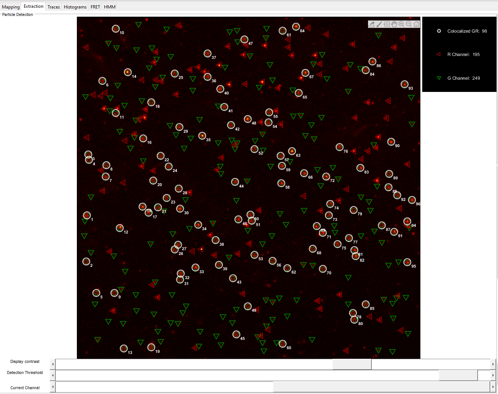
   
... text ... 

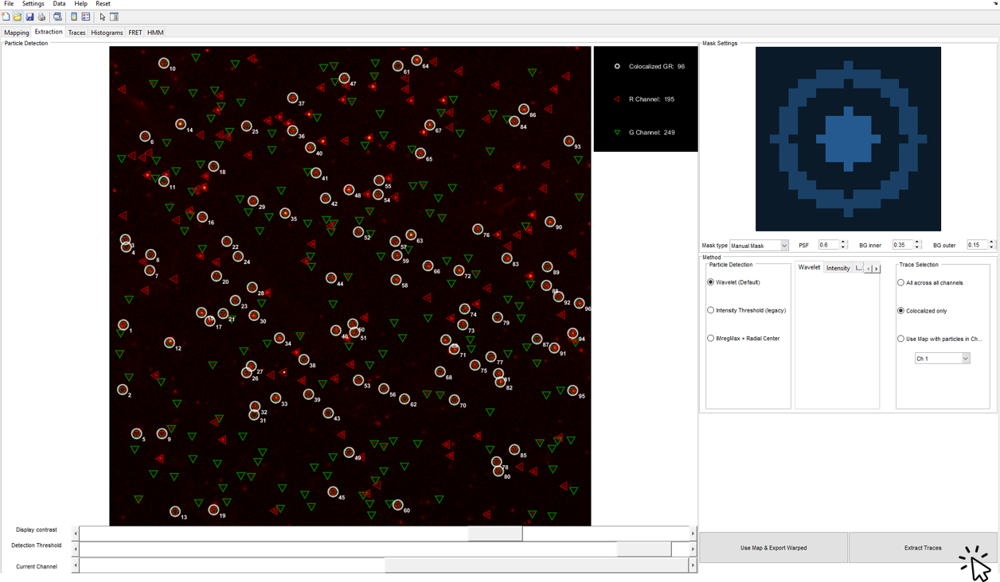
   
... text ... 

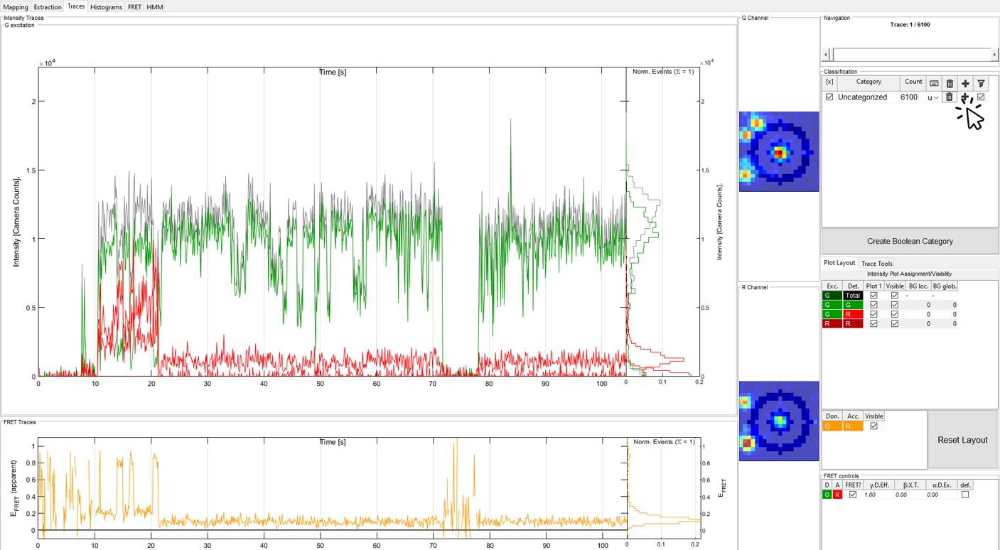
   
... text ... 

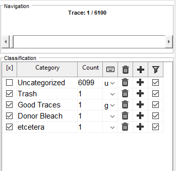
   
... text ... 

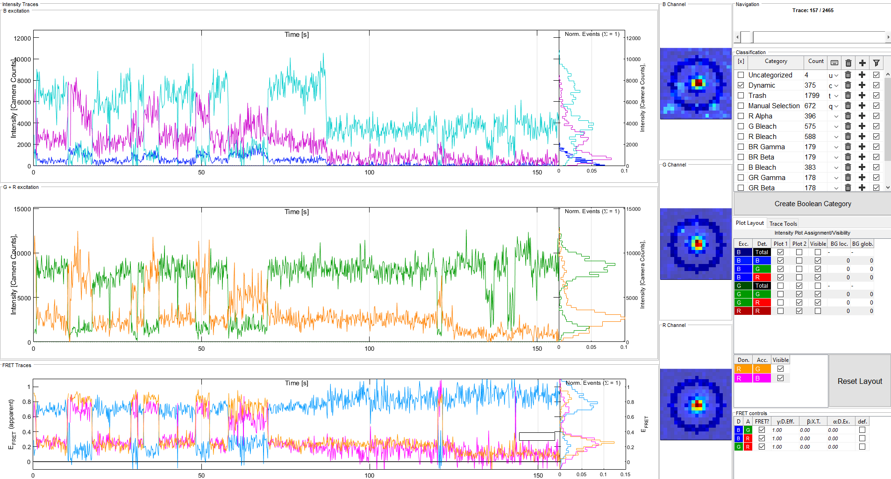
   
... text ... 

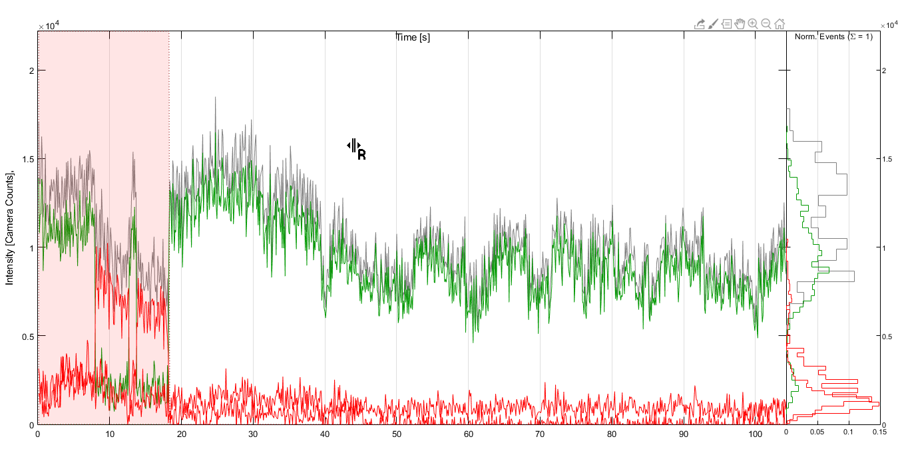
   
... text ... 

.. image:: ./../figures/documents/Fig_23_Correction_Factor_Table.png
   :width: 300
   :alt: correction factor table
   
... text ... 

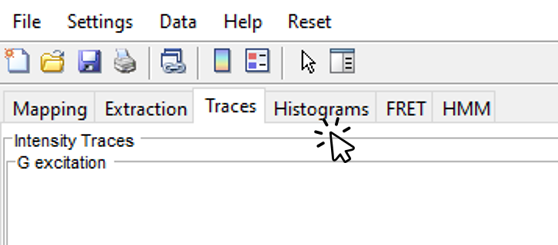
   
... text ... 

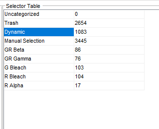
   
... text ... 

.. image:: ./../figures/documents/Fig_26_Measurement_Histograms.png
   :width: 300
   :alt: measurement histograms
   
... text ... 

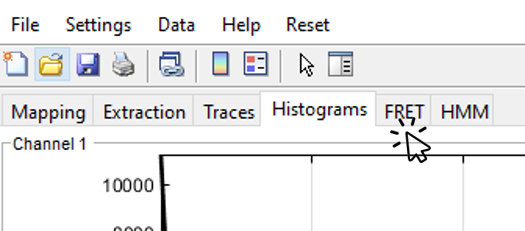
   
... text ...

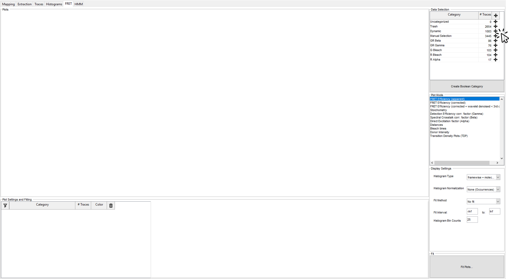
   
... text ...

.. image:: ./../figures/documents/Fig_29_Result_Histogram.png
   :width: 300
   :alt: get histogram
   
... text ...

.. image:: ./../figures/documents/Fig_30_Fitting_Histogram.png
   :width: 300
   :alt: fitting
   
... text ...

.. image:: ./../figures/documents/Fig_31_HMM_Tab.png
   :width: 300
   :alt: going to HMM tab
   
... text ...

.. image:: ./../figures/documents/Fig_32_HMM_Starting.png
   :width: 300
   :alt: starting HMM
   
... text ...

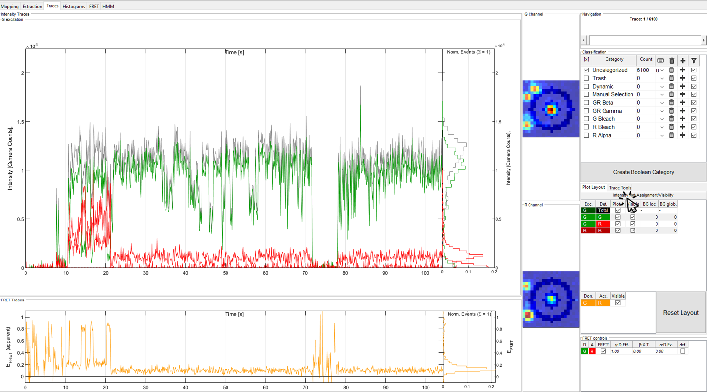
   
... text ...

.. image:: ./../figures/documents/Fig_34_Magic_Button.png
   :width: 300
   :alt: magic button
   
... text ...

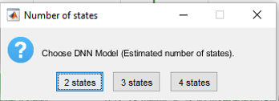
   
... text ...

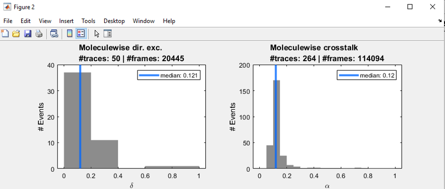
   
... text ...

.. image:: ./../figures/documents/Fig_37_Gamma.png
   :width: 300
   :alt: gamma factor popping window
   
... text ...

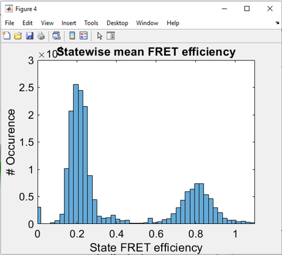
   
... text ...

.. image:: ./../figures/documents/Fig_39_State_Certainty.png
   :width: 300
   :alt: state certainty popping window
   
... text ...

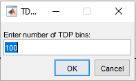
   
... text ...

.. image:: ./../figures/documents/Fig_41_TDP_Cluster_Selection.png
   :width: 300
   :alt: cluster selection
   
... text ...

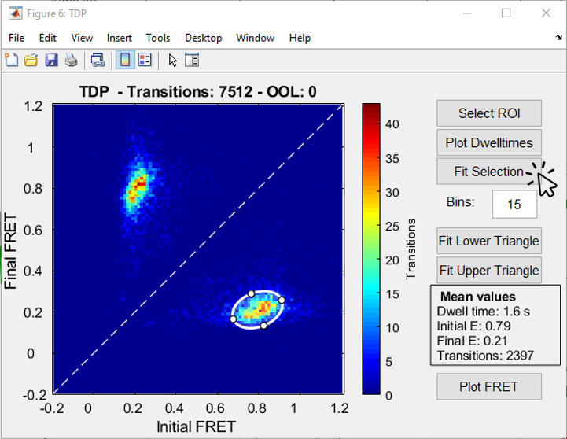
   
... text ...

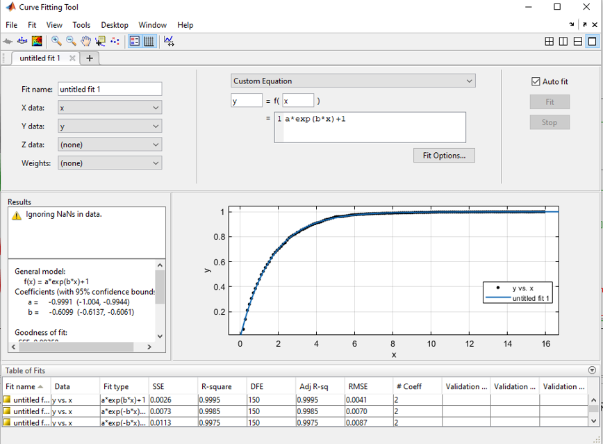
   
... text ...

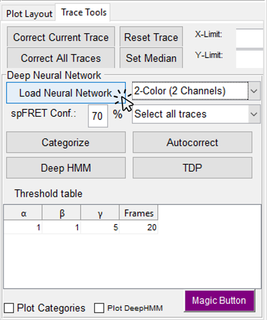
   
... text ...

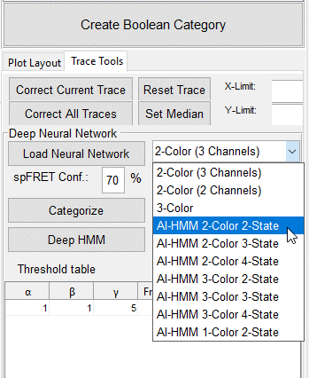
   
... text ...

.. image:: ./../figures/documents/Fig_46_HMM_Result_Choosing.png
   :width: 300
   :alt: Choosing raw or corrected efficiency for TDP
   
... text ...
