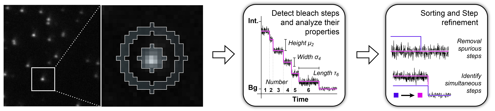

Example Galleries
=====

.. _example:

Deep-LASI can be employed for different single-molecule assays. Below we provide a short intro how get started and
use Deep-LASI for the different single-molecule assays. Please **click on the different images** to visit the corresponding
example pages. 

One-color assays
------------------

Single-color bleaching step analysis
~~~~~~~~~~~~~~~~~~~~~~~~~~~~~~~~~~~~~~

Proteins are frequently functioning as oligomers. Photobleaching step analysis allows for investigating the stoichiometry of a particular protein of interest in a molecular assembly, or determining the labeling efficiency of a single protein. Deep-LASI localizes the biomolecule, extract the fluroescence trajectory, analyzes potential bleaching steps by an automated step finding algorithm and determins the number of itensity levels, their brightness and time spend in the different states. 

|

PAINT: Dwell time analysis
~~~~~~~~~~~~~~~~~~~~~~~~~~~~

In DNA-PAINT, fluorescently labeled *imager strands* transiently bind to complementary *docking strands* on a target structure. 
Besides sequence-based multiplexing, variation of binding time and binding frequency allow for visualizing multiple distinct molecular species within a single sample via DNA-PAINT. Deep-LASI allows for extracting time traces and fluorescence characteristics, to determine the ON- and OFF-times associated with time the imager strand spends in the bound state τ :sub:`b` or diffusing τ :sub:`d` in solution according to the chosen DNA sequence. 

.. image:: ./../figures/examples/PAINT_Figure.png
   :target: ./examples/example-paint.rst
   :width: 500
   :alt: PAINT assay
   :align: center

--------------------------------------------------------------------

Two-color assays
------------------

Static 2c FRET
~~~~~~~~~~~~~~~~

The following section describes how to analyse single-molecule FRET occuring between a donor and an acceptor, which
are positioned at two fixed distances apart using alternating laser excitation (ALEX). We provide two examples for
publicly available sample data from `Wanninger et al., 2023 (under review)` _<link text>: <target> and .. _Hellenkamp et al., Nat. Meth (2018): https://www.nature.com/articles/s41592-018-0085-0 .

.. image:: ./../figures/examples/Static_2c_ALEX.png
   :target: ./examples/example-ALEX-TwoColor.rst
   :width: 400
   :alt: PAINT assay
   :align: center

|

Dynamic 2c FRET
~~~~~~~~~~~~~~~~~

... coming soon ...

--------------------------------------------------------------------

Three-color assays
--------------------

Dynamic 3c FRET
~~~~~~~~~~~~~~~~~

... coming soon ...

--------------------------------------------------------------------

3D Tracking of fluorescent particles
--------------------------------------

... coming soon ...

Workflow for extracking and analyzing fluorescent traces and FRET signatures of diffusing particles from 3D-Orbital Tracking microscopy. 
(Mieskes et al., 2023, Small)

