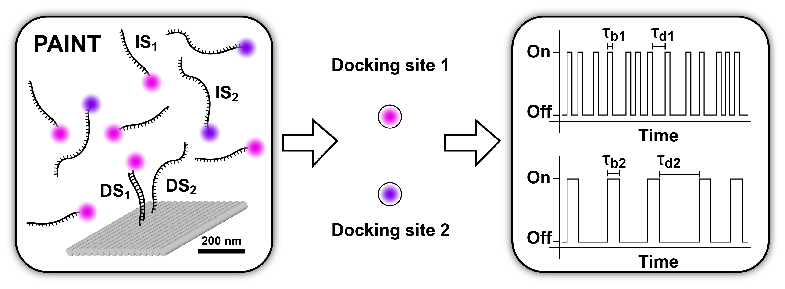

.. toctree::
    :maxdepth: 2

Example Galleries
=====

.. _example:

Deep-LASI can be employed for different single-molecule assays. Below we provide a short intro how get started and
use Deep-LASI for the different single-molecule assays. Please **click on the different images** to visit the corresponding
example pages. 

One-color assays
==================

Single-color bleaching step analysis
------------

Proteins are frequently functioning as oligomers. To investigate the stoichiometry of a particular protein of interest in a molecular assembly, or to assess the labeling efficiency of a single protein, photobleaching step analysis is often used. Deep-LASI localizes the proteins, extract their fluroescence trajectory, analyzes their bleaching step by an automated step finding algorithm and determins the number of itensity levels, their brightness and time spend in the different states. 

.. image:: ./../figures/examples/BleachingStep_Figure.png
   :target: ./examples/example-steps.rst
   :width: 500
   :alt: Bleaching Step Analysis
   :align: center

PAINT: Dwell time analysis
------------

In DNA-PAINT, fluorescently labeled *imager* strands transiently bind to complementary *docking* strands on a target structure. 
Besides sequence-based multiplexing, variation of binding time and binding frequency allow for visualizing multiple distinct molecular species within a single sample via DNA-PAINT. Deep-LASI allows for extracting time traces and fluorescence characteristics, to determine the ON- and OFF-times associated with time the imager strand is bound τ :sub:`b` or diffusing τ :sub:`d` in solution according to the chosen DNA sequence. 

--------------------------------------------------------------------

Two-color assays
==================

Static 2c FRET
------------

... coming soon ...

Dynamic 2c FRET
------------

... coming soon ...

--------------------------------------------------------------------

Three-color assays
====================

Dynamic 3c FRET
------------

... coming soon ...

--------------------------------------------------------------------

3D Tracking of fluorescent particles
======================================

... coming soon ...

Workflow for extracking and analyzing fluorescent traces and FRET signatures of diffusing particles from 3D-Orbital Tracking microscopy. 
(Mieskes et al., 2023, Small)

