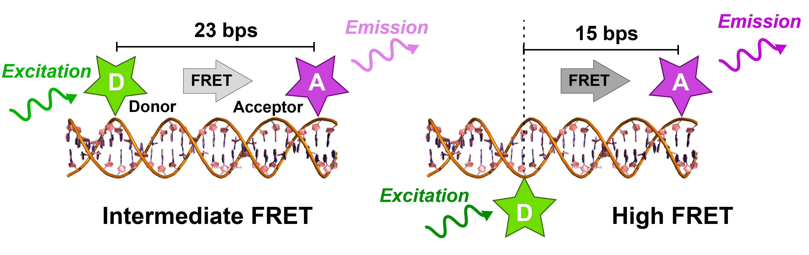

.. :orphan::

Static 2c FRET Data
=====

The following section describes the workflow, when analyzing static, 2-color smFRET (single-molecule Förster Resonance Energy Tranfer) data, 
such as distance rulers based on double-stranded DNA labeled with two fluorophores. 

Deep-LASI provides a modular workflow for analysing the data, either manually or automatically. The analysis starts with the co-localization of fluorescent molecules between both channels and trace extraction , the categorization process, the determination of correction factors, the selection of time windows to be analyzed per single time trace, the kinetic analysis, and ends with a summary of the analyzed traces by calculating the distribution of the correction factors, the FRET and stoichiometry values.

In the example below, we describe the workflow for two double stranded DNAs. Additional publicly available sample data sets can be found in 
`Wanninger et al., BioArxiv (2023) <https://doi.org/10.1101/2023.01.31.526220>`_. 

Example Data
------------------
Static Double-Stranded DNA
~~~~~~~~~~~~~~~~~~~~~~~~~~~~~~~~~~~~~~
The first data set chosen in the multi-laboraory `benchmark study <https://www.nature.com/articles/s41592-018-0085-0>`_, enclode double-labeled DNA molecules. Two different samples with low (:numref:`fig_DNA` (left)) and intermediated FRET (:numref:`fig_DNA` (right)) were designed, where the attached fluorophore pairs are separated by 23 and 15 base pairs, respectively. 

   
   Double-Stranded DNA labeled with the donor dye Atto550 and acceptor dye Atto647N in 23 bp distance (left) and 15 bp separation (right).

Data set 2
~~~~~~~~~~~~~~~~~~~~~~~~~~~~~~~~~~~~~~
